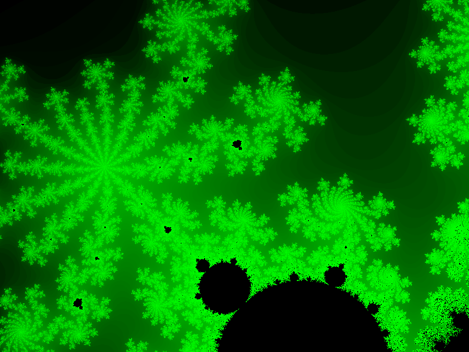

# Mandelbrot Fractal Ctreator

This is the repository of Mandelbrot Fractal creator. In case if you don't know what a fractal is, A fractal is a never-ending pattern. Fractals are infinitely complex patterns that are self-similar across different scales. They are created by repeating a simple process over and over in an ongoing feedback loop. [(click here for more info)](https://fractalfoundation.org)

The Mandelbrot set is the set of complex numbers c for which the function f(z)=z^{2}+c} f(z)=z^{2}+c} does not diverge when iterated from z=0, i.e., for which the sequence f(0), f(f(0)), etc., remains bounded in absolute value. [(Click here for more info)](https://en.wikipedia.org/wiki/Mandelbrot_set)

This project is created using c++17. What this project actually does is creates a Bitmap file and loops through the each pixel position applying Mandelbrot equation (f(z)=z^{2}+c} f(z)=z^{2}+c}). For the maximum thousand iterations if the complex number associated to that pixel position goes above two, then we colour it with  different colour as compred to those which remains bounded. With the mixture of different colors after iterating through all the pixel position and caculating there color values and we stored these values in BitMap file format. It produces a very beautiful image pattern, which is called Mandelbrot Fractal.

## Dependencies for Running Locally
* cmake >= 3.14.4
  * All OSes: [click here for installation instructions](https://cmake.org/install/)
* make >= 4.1 (Linux, Mac), 3.81 (Windows)
  * Linux: make is installed by default on most Linux distros
  * Mac: [install Xcode command line tools to get make](https://developer.apple.com/xcode/features/)
  * Windows: [Click here for installation instructions](http://gnuwin32.sourceforge.net/packages/make.htm)
* gcc/g++ >= 5.4
  * Linux: gcc / g++ is installed by default on most Linux distros
  * Mac: same deal as make - [install Xcode command line tools](https://developer.apple.com/xcode/features/)
  * Windows: recommend using [Visual Studio 2017](https://visualstudio.microsoft.com/downloads/)

## Basic Build Instructions

### For Linux & Mac
1. Clone this repo.
2. Make a build directory in the top level directory: `mkdir build && cd build`
3. Compile: `cmake .. && make`
4. Run it: `Debug/MandelbrotFractal`.

### For Windows using Visual Studio
1. Clone this repo.
2. Make a build directory in the top level directory: `mkdir build && cd build`
3. Compile `cmake --build .`
4. Navigate to  build directory and double click on `MandelbrotFractal.sln` file.
5. Right click on the `MandalbrotFractal` project in solution explorer and click on `Rebuild`.
6. Again Right click on the `MandelbrotFractal` project in solution explorer and click on `set as startup project`.
7. press `F5` and run the project.
8. Wait for some time, when it says `finished` navigate to `Mandelbrot_Fractal\generated_image` folder u will see the generated image      similar to the one given below.

# Output

# File Structure

# Project Rubrics

1. The project demonstrates an understanding of C++ functions and control structures.
  * File: `FractalCreator.cpp`, Line: `16, 17, 24`
  
2. The project reads data from a file and process the data, or the program writes data to a file.
  * File: `Bitmap.cpp`, Line: `26, 27, 28`
  
3. The project uses Object Oriented Programming techniques.
  * File: `Bitmap.h` `Mandelbrot.h` `FractalCreator.h` `ZoomList.h` etc.

4. Classes use appropriate access specifiers for class members.
  * File: `Bitmap.h`, Line: `12, 17`
  * File: `FractalCreator.h`, Line: `15`
  * File: `ZoomList.h`, Line: `8, 17`
  * File: `Mandelbrot.h`, Line: `6, 9`
  
5. Class constructors utilize member initialization lists.
  * File: `Bitmap.cpp`, Line: `8`
  * File: `FractalCreator.cpp`, Line: `4`
  
6. The project uses smart pointers instead of raw pointers.
  * File: `Bitmap.h`, Line: `15`
